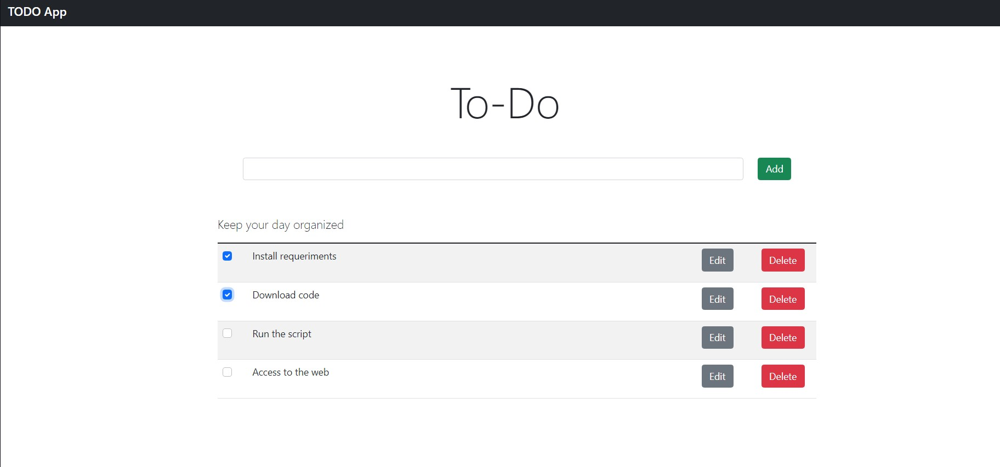

# TO-Do list web app

To-Do list app is a web app use to keep tracking of all your daily task. 
You can add a new item, edit, check or delete.

This software is a single page web application developed with the concept of a REST API
in the server side and a client that communicate with the backend through this API.

### Technologies

The following technologies were used to develop this web application

| Software  |  Version used in this app |
|---|:----:|
| Java JDK | 11.0.12 |
| Spring   | 2.5.6   |
| MySQL    | 8.0.26  |
| Node.js  | 16.13.0 |
| Angular  | 13.0.2  |
| Bootstrap| 5.1.3   |
| Intellij IDEA | 2021.2 |
| Visual Studio Code | 1.62.2 |

## Using the app

### Requirements

First you need to install the following software

| Software  |  Version used in this app |
|---|:----:|
| Java JDK | 11 |
| MySQL    | 8  |
| Node.js  | 16.13 (LTS) |

### Getting the code

Once you have installed all the necessary software, download the software from *this* repository 
through the button **code** => **download zip**

### Bash script

Inside the project folder there is a bash script file that you need to run on your linux 
terminal with the following command:

> sh setup.sh

### Access to the app

Finally, all you have to do is open you favorite web browser and go to this direction

> `http://localhost:4200/`

***Enjoy!***